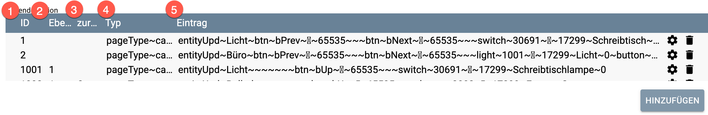

# NSPanelConfig

Dieses Modul bindet das Sonoff NSP-Panel (EU / US) mit der lovelace UI in Symcon ein.

### Inhaltsverzeichnis

1. [Funktionsumfang](#1-funktionsumfang)
2. [Voraussetzungen](#2-voraussetzungen)
3. [Software-Installation](#3-software-installation)
4. [Einrichten der Instanzen in IP-Symcon](#4-einrichten-der-instanzen-in-ip-symcon)
5. [Statusvariablen und Profile](#5-statusvariablen-und-profile)
6. [WebFront](#6-webfront)
7. [PHP-Befehlsreferenz](#7-php-befehlsreferenz)

### 1. Funktionsumfang

* flexible Darstellung beliebiger Menüebenen in beliebiger Schachtelung auf dem Display
* Bildschirmschoner mit Uhrzeit / Datumsanzeige
* frei konfigurierbare Variableneinbindung aus Symcon, um Inhalte von Variablen auf dem Display darzustellen
* anlegen von Aktionen, um RequestActions / Scripte / Scripte mit Parametern aufzurufen
* Ansteueren der Relais
* Entkoppeln der Tasten von den Relais
* Abfragen der Tasten

Aktuell wird der Temp. Sensor nicht abgefragt .

### 2. Voraussetzungen

- IP-Symcon ab Version 6.0

### 3. Software-Installation

* Über das Module Control folgende URL hinzufügen https://github.com/boni127/NSPanel-by-boni.git

### 4. Einrichten der Instanzen in IP-Symcon

 Unter 'Instanz hinzufügen' kann das 'NSPanelConfig'-Modul mithilfe des Schnellfilters gefunden werden.  
	- Weitere Informationen zum Hinzufügen von Instanzen in der [Dokumentation der Instanzen](https://www.symcon.de/service/dokumentation/konzepte/instanzen/#Instanz_hinzufügen)

__Bedienung__:

Die Ansteuerung des Displays erfolgt über die nativen Befehle für das NSPanel, die auf https://docs.nspanel.pky.eu und https://github.com/jobr99/nspanel-lovelace-ui dokumentiert sind.

Die Instanzkonfiguration gliedert sich in den Konfigurations- und Aktions-Bereich, via MQTT Topic wird die ID des zu steuernden NSPanels konfiguriert.
Der Bereich Screensaver ist weitestgehend selbsterklärend und wird mit Werten vorbelegt. Die alternativen DimModes sind weiter unten erläutert.

Die drei Tabellen legen die 

* Seitendefinition
* Wertzuweisungen
* Aktionszuweisungen 

an.

#### Seitendefinitionen

* **ID** (1) definiert die ID der darzustellenden Seite, die Zahl darf zwischen 0 und  9999 liegen, um Konflikte mit Object-ID's in Symcon zu vermeiden
* **Ebene** (2) legt die Ebene der Seite fest, ein leerer Eintrag stellt die Hauptebene da.  Wertebereich 1-9999. Dieser Eintrag wird auch zum Rücksprung zur 
übergeordneten Ebene genutzt, es wird zu der Seite und Ebene gesprungen, die hier angegeben wird
* **zurück zu** (3) definiert die Rücksprungebene, ist hier nichts definiert wird zur ersten Seite der Hauptebene zurückgesprungen.
* **Typ** (4) legt den Seitentyp fest, cardEntities, cardGrid, cardMedia, ....
* **Eintrag** (5) legt den Inhalt der Seite fest, lovelave ui Konfigurationsstring

Ein Beispiel:

ID   | Ebene  | zurück | Typ | Eintrag
---- | ------ | -------| --- | -----
1    |        |        |pageType\~cardEntities  |entityUpd\~Licht\~btn\~bPrev\~\~65535\~\~\~btn\~bNext\~\~65535\~\~\~switch\~30691\~\~17299\~Schreibtisch\~0\~light\~50151\~\~17299\~Wandlampe\~0
2    |        |        |pageType\~cardGrid      |entityUpd\~Büro\~btn\~bPrev\~\~65535\~\~\~btn\~bNext\~\~65535\~\~\~light\~1001\~\~17299\~Licht\~0\~button\~1002\~\~17299\~Rollo
1001 | 1      |        |pageType\~cardEntities  |entityUpd\~Licht\~\~\~\~\~\~\~btn\~bUp\~\~65535\~\~\~switch\~30691\~\~17299\~Schreibtischlampe\~0
1002 | 1      | 2      |pageType\~cardEntities  |entityUpd\~Rolladen\~\~\~\~\~\~\~btn\~bUp\~\~65535\~\~\~shutter\~3002\~\~17299\~Fenster Garten

Die erste dargestellte Seite hat die ID **1**, von hier ausgehend wechseln die Navigationselemente am oberen Rand des Displays zu den Seiten **2**  und wieder auf die **1**.
Seite **2** enthält einen Sprung auf die  Seite **1001** und **1002**. Gekennzeichnet durch den Eintrag in der Spalte *Ebene* wird hier zwischen den Seite **1001** und **1002** gewechselt. Der
Rücksprung in die übergeordnete Ebene erfolgt bei Seite **1001** über den Eintrag *Ebene* zur Seite **1**, abweichend davon springt Seite **1002** auf die Seite **2** zurück. Somit weist *Ebene* nicht nur die 
Zusammengehörigkeit der Menüeinträge aus, sondern auch die Rücksprungseite.   

Hier beispielhaft der Eintrag für die erste Seite. 

`entityUpd~Licht~btn~bPrev~~65535~~~btn~bNext~~65535~~~switch~30691~~17299~Schreibtisch~0~light~50151~~17299~Wandlampe~0`

`entityUpd~Licht~` erzeugt die Überschrift *Licht*
`btn~bPrev~~65535~~~` Navigationspfeil links oben im Display
`btn~bNext~~65535~~~`  Navigationspfeil rechts oben im Display

Wichtig sind hier die Schlüsselworte 

* `bPrev` vorherige Seite aufrufen
* `bNext` nächste Seite aufrufen
* `bUp` übergeordnete Menustruktur aufrufen

Anhand dieser Schlüsselworte erkennt das NSPanel-Modul die Navigation in der Menüstruktur

`switch~30691~~17299~Schreibtisch~0` ist das erste Element auf der Seite, ein Element vom Type Switch in der Farbe 17299 mit der Beschriftung *Schreibtisch*.

Wichtig ist hier der zweite Eintrag in der durch ~ Zeichen getrennten Liste. Hier steht der interne Name des Elements auf der Seite: 30691.
An dieser Stelle erwartet das Module entweder eine Objekt-ID eines Symcom Objektes ( 10000-60000 ) oder die ID einer Seiten, die aufgerufen werden soll.

Analog dazu das zweite Element auf dieser Seite:

`light~50151~~17299~Wandlampe~0` Dies erzeugt das Element *Wandlampe* vom Typ light. Das Symcon Object dazu ist die ID 50151.

Das war es auch schon, nun kann in den Seiten navigiert werden und über die Schalter  *Wandlampe* und Schreibtisch die ersten Objekte geschaltet werden.

Der Menüeintrag mit der ID *2* ist vom Typ cardGrid und stellt bis zu 6 Elemente auf der Seite dar.
Der Anfang `entityUpd~Büro~btn~bPrev~~65535~~~btn~bNext~~65535~~~` definiert wieder Überschrift und Navigationsbuttons,
`light~1001~~17299~Licht~0~` das erste Element welches das Untermenü *1001* aufruft. `button~1002~~17299~Rollo` ist das zweite Element auf dieser Seite, welches Untermenü *1002* aufruft.

Menü *1001* ist wieder vom Typ cardEntities und stellt einen Switch dar, hier wieder das Symcon Objekt 30691.  Abweichend von den Menüs *1* und *2* gibt es hier nur auf der rechten Seite einen Navigationsbutten um
wieder in die übergerodnete Menüebene zurückzukehren. Dies wird durch einen leeren Eintrag für den linken Navigationsbutton erreicht:

`entityUpd~Licht~`  erzeugt die Überschrift Licht
`~~~~~~` Navigationspfeil links, und somit leer
`btn~bUp~~65535~~~` Navigationspfeil rechts
`switch~30691~~17299~Schreibtischlampe~0` Element vom Typ Switch für Symcon Objekt 30691

Menü *1002* ist ebenfalls vom Typ cardEntities, hier wird abweichend von Menü *1001* ein Rollo bedient

`entityUpd~Rolladen~` erzeugt die Überschrift Licht
`~~~~~~` Navigationspfeil links, und somit leer
`btn~bUp~~65535~~~` Navigationspfeil rechts
`shutter~3002~~17299~Fenster Garten` Element vom Typ shutter. Da das Shutter Element nicht über on/off sondern über up/stop/down gesteuert wird, müssen wir etwas mehr zaubern. Dazu wird eine Aktionszuweisung *3002* definiert. Die ID der Aktion ist frei wählbar, es kann auch die Symcon Objekt der Rollo-Instanz genommen werden. Die Aktionszuweisung erfolgt somit für

Objekt/Seite *3002* mit den Werten:

result | filter | Aktion        | Objekt | toggle | maxstep | value
------ | ------ | ------------- | ------ | ------ | ------- | -----
stop   |        | RequestAction | 18163  |  off   | 0       | 2
up     |        | RequestAction | 18163  |  off   | 0       | 0
down   |        | RequestAction | 18163  |  off   | 0       | 4

18163 ist die Objekt-ID des Shelly_Roller, Der Shelly erwartet die Kommandos für die Rollfahrt als nummerische Werte: 0 - up, 2 - stop, 4 - down 

Weitere Details zur Aktionszuweisung weiter unten.

Damit sind wir fast fertig, im NSPanel werden bis jetzt aber noch keine Status-Änderungen aktualisiert. Das geschieht über Wertzuweiung. Somit legen wir hier zwei Wertzuweiungen an, für Menü *1* und *1001*

Für Menü *1*

Variable                          | Wert            | Trenner | formatiert | Länge | Ergebnisspalte
--------------------------------- | --------------- | ------- | ---------- | ----- | --------------
Status-Variable von Symcon-Objekt | Variableninhalt |         | off        |       | 19

und ebenfalls für Menü *1001*

Variable                          | Wert            | Trenner | formatiert | Länge | Ergebnisspalte
--------------------------------- | --------------- | ------- | ---------- | ----- | --------------
Status-Variable von Symcon-Objekt | Variableninhalt |         | off        |       | 19

Die Ergebnisspalte ist die Stelle im NSPanel-Konfig-String mit der Wertangabe zum jeweiligen Element
`entityUpd~Licht~btn~bPrev~~65535~~~btn~bNext~~65535~~~switch~30691~~17299~Schreibtisch~`SPALTE19`~light~50151~~17299~Wandlampe~0`
Zur einfacheren Orientierung gibt es in der Aktionssektion der Konfigurationsseite einen List-Helper.

Infos zur Syntax des lovelace ui sind hier https://docs.nspanel.pky.eu und https://github.com/jobr99/nspanel-lovelace-ui zu finden.

##### popupNotify (veralet, wird noch überarbeitet)

Beim direkten Aufruf der Infoseite pageType~popupNotify aus dem Menü ergibt sich folgende Besonderheit: Die Seite popupNotofy hat am oberen Bildschirmrand keine Navigationstasten, sondern nur ein Exit. Somit muß in der Seitendefinition eine Rücksprungadresse entweder über *Ebene* oder *zurück* angegeben werden. Fehlen diese Angeben erfolgt der Rücksprung zur ersten Menuseite.

Beispiel:

ID   | Ebene  | zurück | Typ | Eintrag
---- | ------ | -------| --- | -----
1    |        |        |pageType~cardEntities|entityUpd~Leuchten\~1\|1\~light\~30691\~\~17299\~Hue Lampe\~0\~...
2    |        |        |pageType~cardMedia   |entityUpd~Bad\~2\|\~41321\~\~17690\~Title-line\~17690\~author-line...
10   |        |        |pageType~cardGrid    |entityUpd~Radio\~1\|1\~light\~1101\~\~17299\~Fav1\~1\~....
1104 | 1      |        |pageType~cardGrid    |entityUpd~Szenen\~2\|1\~light\~1102\~\~17299\~Szene 1\~1\~...
1105 | 1      |        |pageType~cardGrid    |entityUpd~Szenen\~1\|0\~light\~1108\~\~17299\~Szene 6\~1\~light\~1109\~\~17299\~Szene 7\~1
3    |        | 2      |pageType~popupNotify |entityUpdateDetail\~9999\~Hinweis\~23456\~Ja\~17289\~Nein\~34131\~Info\~17299\~0

Wird hier nun Seite **3** aufgerufen, führt das Verlassen von Seite **3** direkt zu Seite **2**.

### Wertzuweisung

Über die Tabelle Wertzuweisung werden die Verknüpfungen der Symcon Objekte mit den einzelnen Seiten auf den Panel definiert.

* **Seite** : legt fest für welche Seite die Wertzuweisung gültig ist
* **Variable** : Objekt-ID der IPS Variable, die auf dem Display dargestellt werden soll
* **Wert** : der Variableninhalt (default) oder der Variablenwert wird ausgelesen ( hilfreich, wenn bspw. Variablen mit dem Namen einer Stationstaste beim Radio ausgelesen werden sollen) 
* **Trenner** : das Lovelace UI Element numbers erwartet einen Wertebereich (akt. Wert\|Min\|Max) durch \| getrennt. Hier kann der Trenner festgelegt werden. Bislang habe ich aber nur das Pipe-Symbol als Trenner gefunden
* **formatiert** : fragt die im IPS Variablenprofil hinterlegte Einheit mit ab
* **Länge** : Anzahl der Zeichen, die aus der Variable oder dem Variablennamen ausgelsen werden. Ist die Länge des Wertes oder des Variablennamen länger als **Länge** wird ab **Länge** abgeschnitten und um '...' ergänzt 
* **Ergebnisspalte** : Ziel für den Wert im Konfigurationsstring des Displays

##### Beispiel:

Im IPS ist ein Dimmer und ein Switch angelegt, die Helligkeit des Dimmers ist in der IPS Variable 10007, der Status des Switch in 30691 definiert.

Mit dieser Seiten Definition wird ein Switch und ein Slider auf dem NSPanel angezeigt

ID   | Ebene  | zurück | Typ | Eintrag
---- | ------ | -------| --- | -----
1    |        |        |pageType\\~cardEntities|entityUpd\~Test\~btn\~bPrev\~\~65535\~\~\~btn\~bNext\~\~65535\~\~\~switch\~50151\~\~17299\~Wandlampe\~0\~number\~10006\~\~17299\~Schreibtisch\~0\|0\|255

Der Eintrag ist durch das \~ Symbol in 26 Spalten getrennt, Spalte 0 - 25

In der Tabelle Wertzuweisung werden nun folgende Zuordnungen für die Seite **1** festgelegt

Variable | Trenner | formatiert | Ergebnisspalte
-------- | ------- | ---------- | --------------
30691    |         |            | 19
10006    | \|      |            | 25

Damit kann nun vom Display der Switch 30691 und der Dimmer 10006 bedient werden, ändern sich die IPS-Variablne, wird der Displayinhalt aktualisiert. Die Interaktion mit IPS erfolgt über RequestAktion

### Aktionszuweisung

Werden andere Interaktionen mit IPS benötigt können diese in der Tabelle Aktionszuweisungen angelegt werden.
Interaktionen mit dem Display senden einen Antwortstring an IPS. Ist der Switch *debug* aktiviert, werden diese ins Logfile geschrieben.

* **Seite/ Objekt** : ID des Objektes oder der aufgerufenen Seite
* **result** : Antwortstring des Elements
* **Aktion** : Auswahl der zu startenden Aktion: RequestAktion, RunScript, RunScriptEx, Aufruf einer Displayseite
* **toggle** : Abfrage einer boolschen Variable und Wechsel des Wertes, um beispielsweise über einen Button auf einer cardGrid eine Lampe ein- und auszuschalten.
Wird **toggle** gesetzt, erfolgt für die nachfolgenden Felder **maxstep** und **value** keine Auswertung mehr
* **maxstep** : begrenzt den Wert auf eine  mit **maxstep** definierte Schrittweite. Beispiel Lautstärkeregler. Aktuelle Lautstärke 7, **maxstep** ist auf 5 eingestellt,
der Slider für die Lautstärke auf dem Display wird auf 80 eingestellt, über **maxstep** wird die Lautstärke jedoch auf 12 (7+5) begrenzt. Wird **maxstep** gesetzt, erfolgt für das nachfolgende Feld **value** keine Auswertung mehr
* **value** : Wert, der an IPS übermittelt werden soll, wenn dieser von dem im Antwortstring empfangenden Wert abweichen soll

Beispiel:

Ein Button in einem cardGrid gibt beim Betätigen nur die Information über die Betätigung des Buttons zurück:

`event,buttonPress2,1101,button`

Die dritte Spalte gibt die ID des Objektes an, Spalte 4 das Ergebnis. Um nun auf den oberen Antwortstring mit dem Aufruf, bspw. eines Scripts, zu reagieren legt man in der Tabelle *Aktionszuweisung* folgenden Eintrag an:

Seite | 1101

result | filter | Aktion       | Seite/ Objekt | toggle | maxstep | value
------ | ------ | ------------ | ------------- | ------ | ------- | -------
button |        | start script | 34718         |        |         |

34718 ist die Objekt-ID eines Scripts

Nun wird mit der Betätigung des Buttons das Script aufgerufen

Beispiel:

Steuerung eines Rollos mit Shelly, über die Variable *Rollo* des Moduls von Kai Schnittcher kann das Rollo die Aktionen Stop (2), Open (0), Close (4) ausführen. 

Bei der Betätigung des elemets *shutter* auf dem NSPanel liefert das Panel folgende Informationen an das Modul

`event,buttonPress2,18163,up`

`event,buttonPress2,18163,stop`

`event,buttonPress2,18163,down` 

Um das Rollo zu steuern muß diese Definition vorliegen

Seite | 18163

result | filter | Aktion        | Seite/ Objekt | toggle | maxstep | value
------ | ------ | ------------- | ------------- | ------ | ------- | -------
up     |        | RequestAction | 18163         |        |         | 0
stop   |        | RequestAction | 18163         |        |         | 2
down   |        | RequestAction | 18163         |        |         | 4

18163 ist die ID der Variable *Rollo* der Instanz *Shelly2*

### Hilfreiches

Im Aktion-Bereich gibt es einen Listhelper. Hier können die Spalten der einzelnen Seite dargestellt werden, um einfacher die entsprechende Spalte im lovelace ui Konfig-String zu finden

Über die beiden Buttons Send lassen sich zum Testen Konfig-Strings an das Display senden, über Save und Load kann die aktuelle Konfiguration gespeichert und wieder geladen werden.

### ScreenSaver

#### alternative DimMode's

Über den Punkt `alternative DimMode` lassen sich 3 weitere dimModes definieren, die über das Kommando `DBNSP_SetDimMode(<0|1|2|3>)` von extern aufgerufen werden können. Beispielsweise über einen Wochenplan oder per Event bei Sonneauf- oder untergang.
Der Parameter 0 ruft den unter dem Screensaver definierten DimMode `Screensaver DimMode 0` auf; 1,2,3 die entsprechenden DimModes. Beim Start des Moduls wird immer der zuletzt gesetzte DimMode aktiviert.
DimMode 1-3 übersteueren den `DimMode after Screensaver Timeout`

Mit `DimMode after Screensaver Timeout` kann eine weitere Stufe des DimModes definiert werden. Wenn aktiviert, startet nach Aktivierung des Screensavers im NSPanel eine Zeitspanne `time until Dimmode starts` nach der sich der DimMode `Screensaver DimMode T` aktiviert.

Bespiel:  

Screensaver DimMode 0 | Screensaver Timeout | DimMode after Screensaver Timeout | time until DimMode starts | Screensaver DimMode T 
--------------------- | ------------------- | --------------------------------- | ------------------------- | ---------------------
dimmode\~20\~100        | timeout\~15          | aktiv                             | 1200                      | dimmode\~0\~50

Der Screensaver wird nach 15 Sekunden aktiv, nach weiteren 20 Min (1200 s), startet der DimMode `Screensaver DimMode T` und die Anzeige des NSPanel wird in diesem Fall (dimmode~0~x) abgeschaltet.
Der `DimMode after Screensaver Timeout` ist nur aktiv, wenn der DimMode via `DBNSP_SetDimMode` auf 0 (default) gesetzt ist.

Über das Kommando `ActiveDimModeTimer` kann der Timer neu gestartet werden, beispielsweise um mittels Bewegungsmelder das NSPanel wieder zu aktivieren

 
### 5. Statusvariablen und Profile

#### Statusvariablen

Aktuell keine

#### Profile

Aktuell keine

### 6. WebFront

Die Funktionalität, die das Modul im WebFront bietet.

Aktuell keine.

### 7. PHP-Befehlsreferenz

Aktuell keine.
